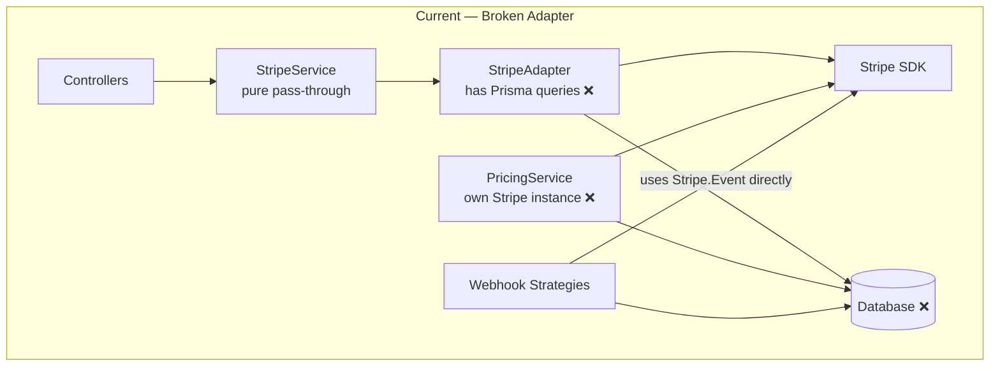
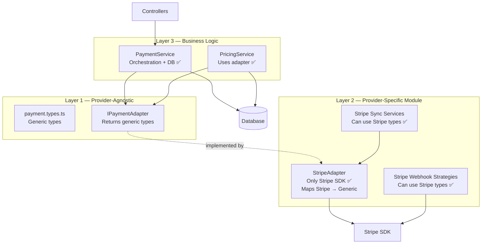

# Adapter Pattern — Implementation Plan

## The Problem

Your current adapter has **3 violations** of the adapter pattern:



| # | Problem | Where |
|---|---------|-------|
| 1 | **Leaky abstraction** — `IPaymentAdapter` returns Stripe-specific types (`Stripe.Customer`, `Stripe.Subscription`), so every consumer depends on the Stripe SDK | [payment-adapter.interface.ts](file:///d:/Down/JWT_DB_Demo/src/stripe/adapter/payment-adapter.interface.ts) |
| 2 | **Business logic in adapter** — `StripeAdapter` queries Prisma for free plans and creates payment records | [stripe.adapter.ts L66-72, L122-140, L226-235](file:///d:/Down/JWT_DB_Demo/src/stripe/adapter/stripe.adapter.ts) |
| 3 | **Adapter bypassed** — `PricingService` creates its own Stripe SDK instance | [pricing.service.ts L9-16](file:///d:/Down/JWT_DB_Demo/src/pricing/pricing.service.ts) |

**Result:** If you add a second provider (e.g., PayPal, LemonSqueezy), you'd need to change ~13 files that directly import `Stripe` types — not just swap one adapter.

---

## The Correct Architecture



### Key Principles

1. **`IPaymentAdapter`** returns **generic types** (no `Stripe.*` imports) — this is the swappable boundary
2. **`StripeAdapter`** is a thin wrapper — only calls Stripe SDK, maps results to generic types, **no Prisma**
3. **`PaymentService`** (upgraded from `StripeService`) handles orchestration, DB queries, and business logic
4. **Webhook strategies stay Stripe-specific** — they live inside `src/stripe/` and are inherently provider-coupled (each provider has different webhook formats). This is **correct** — no need to abstract webhooks.
5. **`PricingService`** uses the adapter for product/price creation instead of its own Stripe instance

---

## Proposed Changes

### Phase 1: Create Provider-Agnostic Types

#### [NEW] `src/payments/types/payment.types.ts`

These types represent what **any** payment provider returns. No Stripe import needed.

```typescript
// --- Customer ---
export interface PaymentCustomer {
  id: string;
  email: string;
  name?: string | null;
  deleted?: boolean;
  metadata?: Record<string, string>;
}

// --- Subscription ---
export interface PaymentSubscription {
  id: string;
  customerId: string;
  status: string;              // 'active', 'past_due', 'canceled', etc.
  items: PaymentSubscriptionItem[];
  currentPeriodStart: number;  // unix timestamp (seconds)
  currentPeriodEnd: number;
  cancelAtPeriodEnd: boolean;
  cancelAt?: number | null;
  trialStart?: number | null;
  trialEnd?: number | null;
  cancellationReason?: string | null;
  created: number;
}

export interface PaymentSubscriptionItem {
  priceId: string;
  currentPeriodStart: number;
  currentPeriodEnd: number;
}

// --- Invoice ---
export interface PaymentInvoice {
  id: string;
  customerId: string;
  subscriptionId?: string | null;
  amountDue: number;           // in provider's smallest unit
  amountPaid: number;
  currency: string;
  status: string;
  billingReason?: string | null;
  periodStart: number;
  periodEnd: number;
  dueDate?: number | null;
  attemptCount: number;
  nextPaymentAttempt?: number | null;
  paymentIntentId?: string | null;
  lines: PaymentInvoiceLine[];
}

export interface PaymentInvoiceLine {
  type: string;
  priceId?: string | null;
  subscriptionId?: string | null;
}

// --- Checkout ---
export interface CheckoutSession {
  id: string;
  url: string | null;
}

// --- Payment Intent ---
export interface PaymentIntentResult {
  id: string;
  clientSecret: string | null;
  amount: number;
  currency: string;
  status: string;
  metadata?: Record<string, string>;
}

// --- Billing Portal ---
export interface BillingPortalSession {
  url: string;
}

// --- Webhook Event ---
export interface WebhookEvent {
  id: string;
  type: string;
  data: unknown;     // raw provider data — strategies will cast
  created: number;
}

// --- Product / Price (for PricingService) ---
export interface RecurringInterval {
  interval: 'day' | 'week' | 'month' | 'year';
  intervalCount: number;
}

export interface CreateCheckoutParams {
  customerId?: string;
  priceId: string;
  mode: 'payment' | 'subscription';
  metadata?: Record<string, string>;
  successUrl?: string;
  cancelUrl?: string;
  subscriptionMetadata?: Record<string, string>;
}

export interface CreatePaymentIntentParams {
  amount: number;
  currency: string;
  customerId?: string;
  description?: string;
  metadata?: Record<string, string>;
}
```

---

### Phase 2: Redesign `IPaymentAdapter`

#### [MODIFY] `src/payments/types/payment-adapter.interface.ts`

> [!IMPORTANT]
> The interface moves from `src/stripe/adapter/` to `src/payments/types/` — it's provider-agnostic and doesn't belong inside the Stripe module.

```typescript
import {
  PaymentCustomer,
  PaymentSubscription,
  PaymentInvoice,
  CheckoutSession,
  PaymentIntentResult,
  BillingPortalSession,
  WebhookEvent,
  CreateCheckoutParams,
  CreatePaymentIntentParams,
  RecurringInterval,
} from './payment.types';

export interface IPaymentAdapter {
  // --- Customer ---
  createCustomer(email: string, name?: string, metadata?: Record<string, string>): Promise<PaymentCustomer>;
  deleteCustomer(customerId: string): Promise<void>;
  getCustomer(customerId: string): Promise<PaymentCustomer | null>;
  customerExists(customerId: string): Promise<boolean>;

  // --- Subscription ---
  createSubscription(customerId: string, priceId: string): Promise<PaymentSubscription>;
  cancelSubscriptionAtPeriodEnd(subscriptionId: string): Promise<void>;
  cancelSubscriptionNow(subscriptionId: string): Promise<void>;
  listSubscriptions(customerId: string): Promise<PaymentSubscription[]>;
  getLatestPaidInvoice(subscriptionId: string): Promise<PaymentInvoice | null>;

  // --- Checkout / Payment ---
  createCheckoutSession(params: CreateCheckoutParams): Promise<CheckoutSession>;
  createPaymentIntent(params: CreatePaymentIntentParams): Promise<PaymentIntentResult>;
  createBillingPortalSession(customerId: string, returnUrl?: string): Promise<BillingPortalSession>;
  hasDefaultPaymentMethod(customerId: string): Promise<boolean>;

  // --- Webhook ---
  constructWebhookEvent(rawBody: Buffer, signature: string): WebhookEvent;

  // --- Product & Price management (for PricingService) ---
  createProduct(name: string): Promise<string>;  // returns productId
  createRecurringPrice(productId: string, amount: number, currency: string, recurring: RecurringInterval): Promise<string>;  // returns priceId
  createOneTimePrice(productId: string, amount: number, currency: string): Promise<string>;  // returns priceId
}
```

**What changed:**
- No `Stripe.*` imports
- Returns generic types instead of `Stripe.Customer`, etc.
- Removed `getFreePriceId()`, `ensureFreeSubscription()`, `subscribeToFreePlan()` (these are business logic → move to service layer)
- Removed `userId` from adapter params (adapter doesn't need to know about users)
- Added `createProduct`, `createRecurringPrice`, `createOneTimePrice` (so `PricingService` doesn't need its own Stripe instance)
- `createSubscription` replaces `subscribeToFreePlan` (generic operation)
- `listSubscriptions` replaces `findActiveSubscription` (returns raw list, service filters)

---

### Phase 3: Rebuild `StripeAdapter` (Thin Wrapper)

#### [MODIFY] `src/stripe/adapter/stripe.adapter.ts`

The adapter becomes **pure Stripe SDK calls + type mapping**. No Prisma, no business logic.

```typescript
@Injectable()
export class StripeAdapter implements IPaymentAdapter {
  private readonly stripe: Stripe;

  constructor(private readonly configService: ConfigService) {
    // No PrismaService injection ← KEY CHANGE
    const secretKey = this.configService.get<string>('STRIPE_SECRET_KEY');
    if (!secretKey) throw new Error('STRIPE_SECRET_KEY is required');
    this.stripe = new Stripe(secretKey);
  }

  // Maps Stripe.Customer → PaymentCustomer
  async createCustomer(email: string, name?: string, metadata?: Record<string, string>): Promise<PaymentCustomer> {
    const customer = await this.stripe.customers.create({ email, name, metadata });
    return this.mapCustomer(customer);
  }

  // Maps Stripe.Subscription → PaymentSubscription
  async createSubscription(customerId: string, priceId: string): Promise<PaymentSubscription> {
    const sub = await this.stripe.subscriptions.create({
      customer: customerId,
      items: [{ price: priceId }],
    });
    return this.mapSubscription(sub);
  }

  // ... other methods follow same pattern

  // Private mappers — Stripe-specific translation
  private mapCustomer(c: Stripe.Customer | Stripe.DeletedCustomer): PaymentCustomer {
    return {
      id: c.id,
      email: (c as Stripe.Customer).email ?? '',
      name: (c as Stripe.Customer).name ?? null,
      deleted: (c as Stripe.DeletedCustomer).deleted ?? false,
      metadata: (c as Stripe.Customer).metadata ?? {},
    };
  }

  private mapSubscription(s: Stripe.Subscription): PaymentSubscription {
    return {
      id: s.id,
      customerId: typeof s.customer === 'string' ? s.customer : s.customer.id,
      status: s.status,
      items: s.items.data.map(item => ({
        priceId: typeof item.price === 'string' ? item.price : item.price.id,
        currentPeriodStart: (item as any).current_period_start,
        currentPeriodEnd: (item as any).current_period_end,
      })),
      currentPeriodStart: (s.items.data[0] as any)?.current_period_start ?? s.created,
      currentPeriodEnd: (s.items.data[0] as any)?.current_period_end ?? s.created,
      cancelAtPeriodEnd: s.cancel_at_period_end,
      cancelAt: s.cancel_at,
      trialStart: s.trial_start,
      trialEnd: s.trial_end,
      cancellationReason: s.cancellation_details?.reason ?? null,
      created: s.created,
    };
  }

  // ... mapInvoice, mapCheckoutSession, etc.
}
```

**What moved out:**
- `getFreePriceId()` → `PaymentService` (it queries Prisma)
- `ensureFreeSubscription()` → `PaymentService` (business logic)
- `subscribeToFreePlan()` → `PaymentService` calls `adapter.createSubscription()`
- `findActiveSubscription()` → `PaymentService` calls `adapter.listSubscriptions()` + filters
- `createPaymentIntent()` DB write → `PaymentService`

**What was added:**
- `createProduct()`, `createRecurringPrice()`, `createOneTimePrice()` — for `PricingService`
- Private mapper methods (`mapCustomer`, `mapSubscription`, etc.)

---

### Phase 4: Upgrade `StripeService` → `PaymentService`

#### [MODIFY] `src/stripe/stripe.service.ts` → rename or keep

The service is no longer a pure pass-through. It now holds the **business logic** that was incorrectly in the adapter:

```typescript
@Injectable()
export class PaymentService {
  constructor(
    @Inject('PAYMENT_ADAPTER') private readonly adapter: IPaymentAdapter,
    private readonly prisma: PrismaService,
  ) {}

  // Business logic: DB lookup + adapter call
  async getFreePriceId(): Promise<string | null> {
    const freePlan = await this.prisma.plan.findUnique({
      where: { code: PLAN_CODES.FREE },
      include: { pricingOptions: true },
    });
    return freePlan?.pricingOptions[0]?.providerPriceId ?? null;
  }

  // Business logic: check existing + create subscription via adapter
  async ensureFreeSubscription(customerId: string): Promise<PaymentSubscription | null> {
    const freePriceId = await this.getFreePriceId();
    if (!freePriceId) return null;

    const existingSubs = await this.adapter.listSubscriptions(customerId);
    const hasActive = existingSubs.some(s =>
      s.status === 'active' || s.status === 'trialing' || s.status === 'past_due'
    );
    if (hasActive) return null;

    return this.adapter.createSubscription(customerId, freePriceId);
  }

  // Business logic: find + prioritize paid over free
  async findActiveSubscription(customerId: string): Promise<PaymentSubscription | null> {
    const subs = await this.adapter.listSubscriptions(customerId);
    const live = subs.filter(s => ['active', 'trialing', 'past_due'].includes(s.status));
    if (live.length === 0) return null;
    if (live.length === 1) return live[0];

    const freePriceId = await this.getFreePriceId();
    const sorted = [...live].sort((a, b) => b.created - a.created);
    return sorted.find(s => freePriceId == null || s.items[0]?.priceId !== freePriceId) ?? sorted[0];
  }

  // Business logic: adapter call + DB write
  async createPaymentIntent(userId: number, amount: number, currency: string, description?: string, customerId?: string): Promise<PaymentIntentResult> {
    const intent = await this.adapter.createPaymentIntent({
      amount, currency, description, customerId,
      metadata: { userId: String(userId) },
    });

    await this.prisma.payment.create({
      data: {
        providerPaymentId: intent.id,
        amount, currency,
        status: PaymentStatus.PENDING,
        userId,
        provider: PaymentProvider.STRIPE,
      },
    });

    return intent;
  }

  // Pure delegation (no business logic needed)
  async createCustomer(email: string, name?: string, metadata?: Record<string, string>) {
    return this.adapter.createCustomer(email, name, metadata);
  }

  // ... etc
}
```

---

### Phase 5: Fix `PricingService`

#### [MODIFY] `src/pricing/pricing.service.ts`

Remove the private Stripe SDK instance. Use the adapter instead.

```diff
- import Stripe from "stripe";
+ import { IPaymentAdapter } from "../payments/types/payment-adapter.interface";

  export class PricingService {
-   private readonly stripe: Stripe;
    constructor(
      private readonly prisma: PrismaService,
-     private readonly configService: ConfigService,
+     @Inject('PAYMENT_ADAPTER') private readonly adapter: IPaymentAdapter,
    ) {
-     this.stripe = new Stripe(this.configService.get<string>("STRIPE_SECRET_KEY") || "");
    }

    async createPricingOption(data: { ... }) {
      // ...interval calculation stays the same...
-     const product = await this.stripe.products.create({ name: `${plan.name} - ${billingCycle.name}` });
-     const price = await this.stripe.prices.create({ ... });
+     const productId = await this.adapter.createProduct(`${plan.name} - ${billingCycle.name}`);
+     const priceId = await this.adapter.createRecurringPrice(
+       productId,
+       formatDatabaseAmountToStripe(data.price, data.currency),
+       data.currency,
+       { interval, intervalCount },
+     );

      return this.prisma.pricingOption.create({
        data: { ...data, provider: "STRIPE", providerPriceId: priceId },
      });
    }
  }
```

---

### Phase 6: Webhook Strategies — No Change Needed (Intentionally)

> [!NOTE]
> Webhook strategies **correctly stay Stripe-coupled**. Each payment provider has unique webhook formats. When you add PayPal, you'll create `src/paypal/webhook/strategies/` with PayPal-specific strategies. The `WebhookStrategy` interface can remain Stripe-typed since it lives inside `src/stripe/`.

The strategies will continue using `Stripe.Event`, `Stripe.Invoice`, `Stripe.Subscription` directly. This is fine because:
- They live inside `src/stripe/` (provider-scoped module)
- They deal with raw Stripe webhook payloads that are inherently Stripe-specific
- A PayPal module would have its own webhook handler with its own types

However, the sync services (`SubscriptionSyncService`, `PaidInvoiceSyncService`) and `FreePlanDowngradeService` also stay inside `src/stripe/` and can keep using `Stripe.*` types since they're Stripe-specific translation/sync logic.

---

## File Changes Summary

### New Files
| File | Purpose |
|------|---------|
| `src/payments/types/payment.types.ts` | Provider-agnostic type definitions |
| `src/payments/types/payment-adapter.interface.ts` | Clean `IPaymentAdapter` interface |

### Modified Files
| File | Change |
|------|--------|
| `src/stripe/adapter/stripe.adapter.ts` | Remove Prisma, add mapper methods, implement new interface |
| `src/stripe/stripe.service.ts` | Move business logic here from adapter, inject Prisma |
| `src/stripe/stripe.module.ts` | Update provider registration |
| `src/pricing/pricing.service.ts` | Remove own Stripe instance, inject adapter |
| `src/pricing/pricing.module.ts` | Import StripeModule for adapter access |
| `src/users/users.service.ts` | Update method signatures for generic types |
| `src/stripe/webhook/free-plan-downgrade.service.ts` | Use generic types from service layer |
| `src/payments/payments.service.ts` | Update to use generic return types |
| `src/stripe/stripe.controller.ts` | Update to use generic return types |
| `src/payments/payments.controller.ts` | Update to use generic return types |

### Deleted Files
| File | Reason |
|------|--------|
| `src/stripe/adapter/payment-adapter.interface.ts` | Moved to `src/payments/types/` |

### Unchanged Files (Intentionally)
| File | Reason |
|------|--------|
| All webhook strategies | Correctly Stripe-coupled |
| `subscription-sync.service.ts` | Stripe-specific sync logic |
| `paid-invoice-sync.service.ts` | Stripe-specific sync logic |
| `free-plan-downgrade.service.ts` | Uses Stripe types from service layer |

---

## Open Questions

> [!IMPORTANT]
> **Q1: Keep `StripeService` name or rename to `PaymentService`?**
> - Renaming to `PaymentService` is more accurate (it's provider-agnostic orchestration)
> - But it means updating ~15 files that import `StripeService`
> - Alternatively, keep the name but move the class to `src/payments/`

> [!IMPORTANT]
> **Q2: Should `FreePlanDowngradeService` accept generic `PaymentSubscription` instead of `Stripe.Subscription`?**
> - Currently it accesses `stripeSub.items.data[0].current_period_start` — Stripe-specific structure
> - The generic `PaymentSubscription` type already carries this data in a normalized form
> - Switching to generic types would decouple it, but it lives in `src/stripe/` anyway

> [!IMPORTANT]
> **Q3: Where should `IPaymentAdapter` live?**
> - Option A: `src/payments/types/` (provider-agnostic, clean separation) ← **Recommended**
> - Option B: `src/common/interfaces/` (if used across many modules)
> - Option C: Keep in `src/stripe/adapter/` (but defeats the purpose)

---

## Verification Plan

### Automated Tests
```bash
npm run build          # TypeScript compilation succeeds
npm run start:dev      # App boots without errors
```

### Manual Verification
- Test `POST /stripe/checkout/subscription` — creates checkout session
- Test `POST /pricing/options` — creates Stripe product + price via adapter
- Test webhook delivery — strategies still process events correctly
- Verify `POST /payments/customers` — creates customer via adapter
